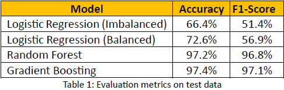
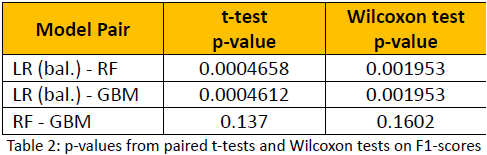

I started this analysis during the Hacklytics 2025 event at Georgia Tech, continued to work on it post the competition and completed it as part of my course project and more of a paersonal project. 

In this project, I am looking into the **Ethereum Dataset** from Kaggle to build a fraud detection model. 

## Objective 📊
1. Classify Ethereum accounts as fraudulent or legitimate
2. Identify key features contributing to fraud detection
3. Compare performance of logistic regression, random forest, and gradient boosting

## Dataset 🧪 
1. Sourced from [Kaggle](https://www.kaggle.com/datasets/rupakroy/ethereum-fraud-detection)
2. 9.8K accounts, 51 features
3. Labelled as fraudulent (1) or legitimate (0)

## Methodology 🔧 
1. Extensive data preprocessing: duplicates and null handling, feature reduction, SMOTE for class balancing
2. Models: Logistic Regression, Random Forest, Gradient Boosting
3. Evaluation metrics: Accuracy, Precision, Recall, F1-Score

## Results 📈 
1. Ensemble models significantly outperform logistic regression
2. Top predictive features: Total ETH received, Transaction span

## Key Insights 🔍
1. Ensemble models effectively detect fraud with >97% F1 scores
2. Imbalanced data handled using SMOTE + downsampling
3. Transaction behavior is a strong fraud indicator

## Future Work 📌 
1. Add SHAP for model interpretability
2. Explore unsupervised learning for new fraud patterns
3. Test on real Ethereum data

The R notebook is available on [Kaggle](https://www.kaggle.com/code/yuktibishambu/yk-ethereum) as well as in this [repository](./yk-ethereum.ipynb). 
Read the full project report here [(PDF)](./Project_report.pdf)
